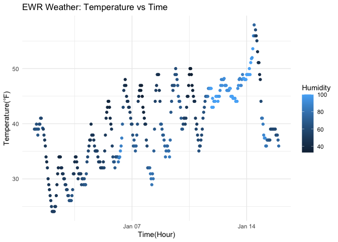

p8105_hw1_xy2719
================
Yao
2025-09-19

## Problem 1

``` r
# Load the tidyverse and moderndive library
library(tidyverse)
```

    ## ── Attaching core tidyverse packages ──────────────────────── tidyverse 2.0.0 ──
    ## ✔ dplyr     1.1.4     ✔ readr     2.1.5
    ## ✔ forcats   1.0.0     ✔ stringr   1.5.1
    ## ✔ ggplot2   3.5.2     ✔ tibble    3.3.0
    ## ✔ lubridate 1.9.4     ✔ tidyr     1.3.1
    ## ✔ purrr     1.1.0     
    ## ── Conflicts ────────────────────────────────────────── tidyverse_conflicts() ──
    ## ✖ dplyr::filter() masks stats::filter()
    ## ✖ dplyr::lag()    masks stats::lag()
    ## ℹ Use the conflicted package (<http://conflicted.r-lib.org/>) to force all conflicts to become errors

``` r
library(moderndive)

# Load the 'early_january_weather' dataset
data("early_january_weather")

# View the dataset
view(early_january_weather)
```

``` r
# Accessing the dataset help file
?early_january_weather

# Get the size of the dataset and the mean of temperature
nrow(early_january_weather)
```

    ## [1] 358

``` r
ncol(early_january_weather)
```

    ## [1] 15

``` r
round(mean(early_january_weather$temp), 1)
```

    ## [1] 39.6

The ‘early_january_weather’ dataset contains hourly meteorological data
for LGA, JFK and EWR for the month of January 2013. This subset data
frame contains hourly weather data of EWR. This dataset includes 358
rows, 15 columns, and 15 variables. The important variables are
‘origin’, ‘year’, ‘month’, ‘day’, ‘hour’, ‘temp’, ‘demp’, ‘humid’,
‘wind_dir’, wind_speed’, wind_gust’, ‘precip’, ‘pressure’, ‘visib’, and
‘time_hour’. The mean temperature during this period was **39.6 °F**.

``` r
# Create a scatterplot of temp (y) vs time_hour (x)
scatter_temp_time = ggplot(early_january_weather,
                           aes(x = time_hour, y = temp, color = humid)) +
  geom_point() +
  labs(x = "Time(Hour)", y = "Temperature(°F)",
       title = "EWR Weather: Temperature vs Time ",
       color = "Humidity") +
  theme_minimal()

# Print the scatterplot
scatter_temp_time
```

<!-- -->

``` r
# Save the scatterplot
ggsave("scatter_temp_time.png", scatter_temp_time, width = 7, height = 4)
```

The scatterplot shows hourly temperature change over time, with points
showing different humidity levels. Temperature goes up and down during
the day, following a daily cycle. Temperatures are generally cooler when
humidity is higher, and warmer when humidity is lower.

## Problem 2

``` r
# Create a dataframe
df <- tibble(
  sample_norm = rnorm(10),
  positive= sample_norm > 0,
  char_vec = sample(letters, 10),
  fac_vec = factor(sample(c("low","med","high"), 10, replace = TRUE),
                    levels = c("low","med","high"))
)

df
```

    ## # A tibble: 10 × 4
    ##    sample_norm positive char_vec fac_vec
    ##          <dbl> <lgl>    <chr>    <fct>  
    ##  1      1.07   TRUE     h        high   
    ##  2      1.36   TRUE     a        low    
    ##  3      0.0415 TRUE     w        low    
    ##  4     -0.765  FALSE    s        low    
    ##  5      0.174  TRUE     p        med    
    ##  6     -2.04   FALSE    n        high   
    ##  7     -0.782  FALSE    i        high   
    ##  8      0.824  TRUE     t        low    
    ##  9      0.365  TRUE     f        low    
    ## 10     -0.426  FALSE    d        low

``` r
# Try taking means
mean(df %>% pull(sample_norm))
```

    ## [1] -0.01752719

``` r
mean(df %>% pull(positive))
```

    ## [1] 0.6

``` r
#mean(df %>% pull(char_vec))
#mean(df %>% pull(fac_vec))
```

Taking the mean of ‘sample_norm’ works because it is numeric data.
Taking the mean of ‘positive’ works because it is logical, TRUE=1,
FALSE=0. Taking the mean of ‘char_vec’ doesn’t work because charaters
cannot be averaged. Taking the mean of ‘fac_vec’ doesn’t work because
factors cannot be averaged.

``` r
# Convert variables type
as.numeric(df$positive)
```

    ##  [1] 1 1 1 0 1 0 0 1 1 0

``` r
as.numeric(df$char_vec)
```

    ## Warning: NAs introduced by coercion

    ##  [1] NA NA NA NA NA NA NA NA NA NA

``` r
as.numeric(df$fac_vec)
```

    ##  [1] 3 1 1 1 2 3 3 1 1 1

For logical variables, when they are converted to numeric, TRUE becomes
1 and FALSE becomes 0, so mean(positive) returns the proportion of TRUE.
For character variables, when they are converted to numeric, they yield
NA since letters aren’t numbers, so mean fails. For factor variables,
when they are converted to numeric, they return the internal integer
codes of levels 1, 2, 3. The mean of those codes is not a meaningful
statistic unless the levels are truly ordered and intentionally mapped
to numeric scores.
